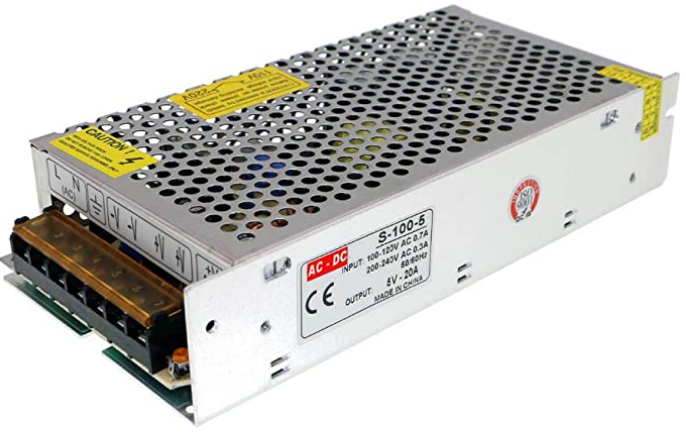

L'essentiel pour commencer
==========================

Le matériel :
-------------

Le bras robot ARM-21N2

.. |bras| image:: ./_static/images/bras_onshape.png
   :width: 50pt
   :height: 50pt
   :align: middle

.. |pompe| image:: ./_static/images/kit_pompe.png
   :width: 50pt
   :height: 50pt
   :align: middle

.. list-table:: Nomenclature
   :widths: 30 40 20 50
   :align: center
   :header-rows: 1

   * - Nom
     - Image
     - Quantité
     - Description
   * - Bras ARM-21N2
     - |bras|
     - 1
     - bras ARM-21N2
   * - Raspberry pi
     - |rpi|
     - 1
     - Modèle Rpi 3 B+
   * - Module PWM
     - |pca|
     - 1
     - PCA 9685
   * - Kit Pompe 5v
     - |pompe|
     - 1
     - Pompe 5v
        tube silicone
        ventouse
        électrovanne
        interrupteur électronique pwm
   * - Alimentation 5V
     - |alim|
     - 1
     - Alimentation 5V 10A

Le montage du robot :
---------------------

Le modèle 3D et les plans du bras ARM-21N2 sont accessibles en cliquant sur l'image.

La carte SD et l'image du Rpi
-----------------------------

Pour utiliser le robot, il sera nécessaire de copier l'image du RPI sur la carte SD.

Le raspberry pi est configuré au niveau wifi et le package python est déjà dans l'image.

Utilsez une carte micro SD de 16Go montée dans un adaptateur SD

1- `Téléchargez l'image <http://sourceforge.net/projects/win32diskimager/files/latest/download>`_

2- Copier l'image sur la carte SD :

`Télécharger Win32diskImager <http://sourceforge.net/projects/win32diskimager/files/latest/download>`_

Lancer Win32diskImager

Ouvrir le fichier .img

Selectionner la carte SD (Attention au choix du bon lecteur)

Appuyez sur Write

Le cablage du bras robot
------------------------

Le Raspberry Pi possède des broches réservées pour la communication I2C (GPIO2/GPIO3).
Le module est muni d’un bus I2C et d’une entrée de puissance. 
Le bus I2C est branché comme ceci:

Broche GPIO3 ou SCL à la broche SCL du module
Broche GPIO2 ou SDA à la broche SDA du module
Broche 5V à la broche Vcc du module
Broche GND à la broche GND du module

 
La configuration réseau
-----------------------

L'accès au RPI se fait en wifi en se connectant au point d'accès dont le nom est : Raspi-Webgui

Dans un navigateur saisir l'adresse 10.3.141.1:8050

.. image:: _static/images/pa.png
  :width: 400
 