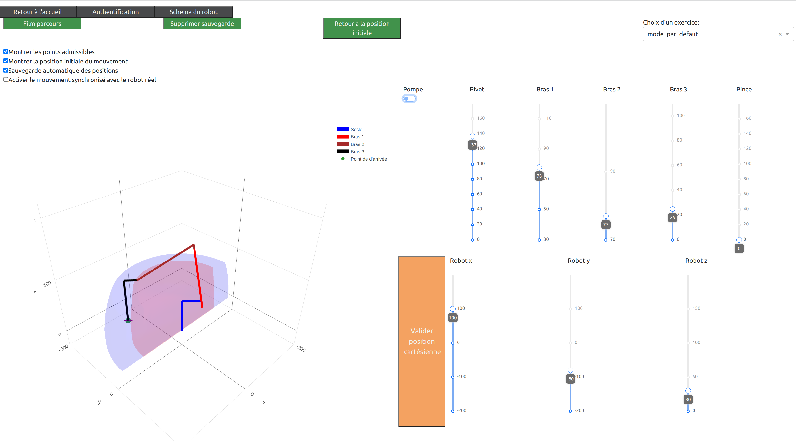

BRAS ROBOTISE COMMANDE A DISTANCE
=================================

Description du projet
---------------------

``bras_ljv`` est un package Python permettant de contrôler un bras robotisé à l'aide d'une interface virtuelle.

.. image:: ./_static/images/bras_onshape.png
  :width: 400

Composantes du projet
---------------------

Le projet mobilise des outils

-- De réseau informatique
    Connexion en Point d'accès ou Ethernet

-- De programmation
    Code python

-- De visualisation
    Lien virtuel / Réel

-- D'algorithmique
    Réaliser un ordonnacement de tâches

-- De construction et modélisation
    Assemblage du robot réel, Virtuel avec Onshape

-- De connectique
    Cablage du Raspberry pi, servos, interface PWM

Applications pédagogiques
-------------------------

-- Commander un bras réel à partir d'une interface virtuelle

-- Trouver un algorithme pour réaliser un déplacement d'objets

-- Gérer les obstacles

Autres Applications
-------------------

-- Ajout d'une pince à la place de la ventouse
    Augmentation de la zone de préhension (la pince n'étant plus forcément verticale ! )

-- Reconnaissance optique d'objets:
    Déplacer, Trier, Ordonner --> déplacer, trier, ordonner des objets de façon automatique selon leur famille (forme, couleur, information ...)
    A partir de photos de l'environnement du robot, ils'agirait d'exploiter des algorithmes dits de 'Computer vision' (Détection automatique d'objets, reconstruction d'espaces en 3D).
    Une fois la scène ainsi recontruite le robot peut effectuer les tâches demandées.
    
    Exemple :

        1- Localiser à partir de photos des jetons numérotés sur un plateau de jeu

        2- Le robot empile automatiquement les jetons par numéros croissants

-- Ajout d'une base motorisée :
    Reconnaissance d'objets dans un espace pour leur traitement 

Structure de la documentation
-----------------------------

.. toctree::
    :maxdepth: 1

    presentation_robot/index.rst
    presentation_interface/index.rst
    essentiel.rst
    exercices/index.rst
    perspectives/index.rst